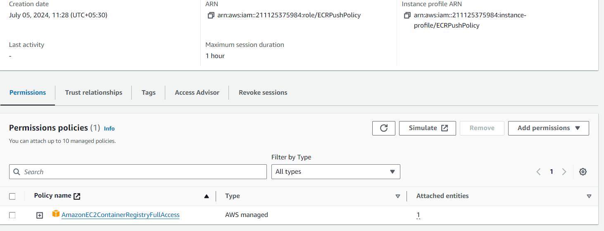
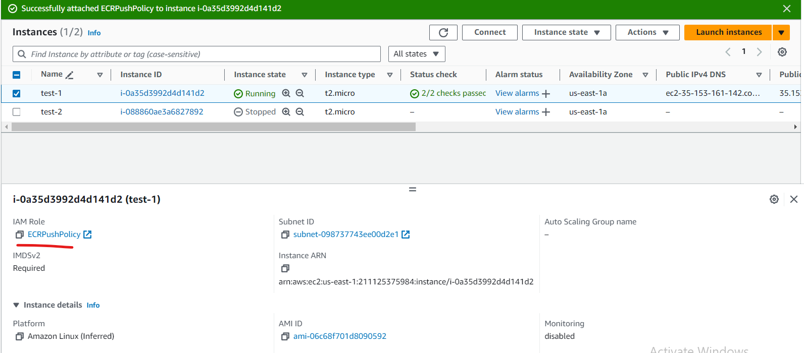
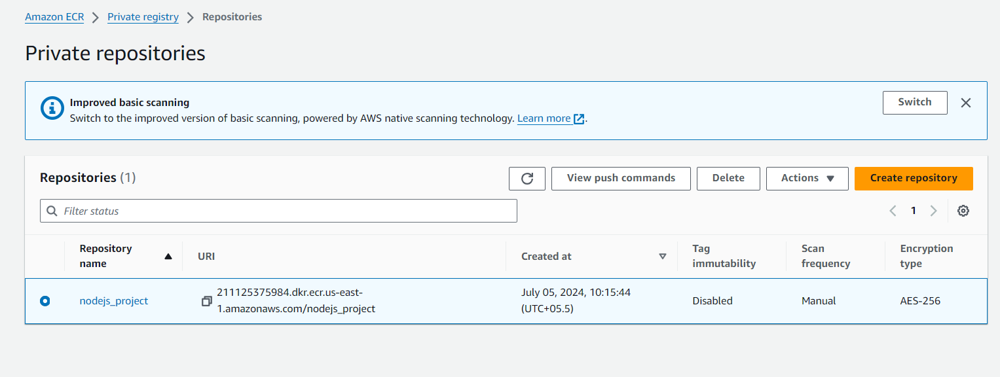
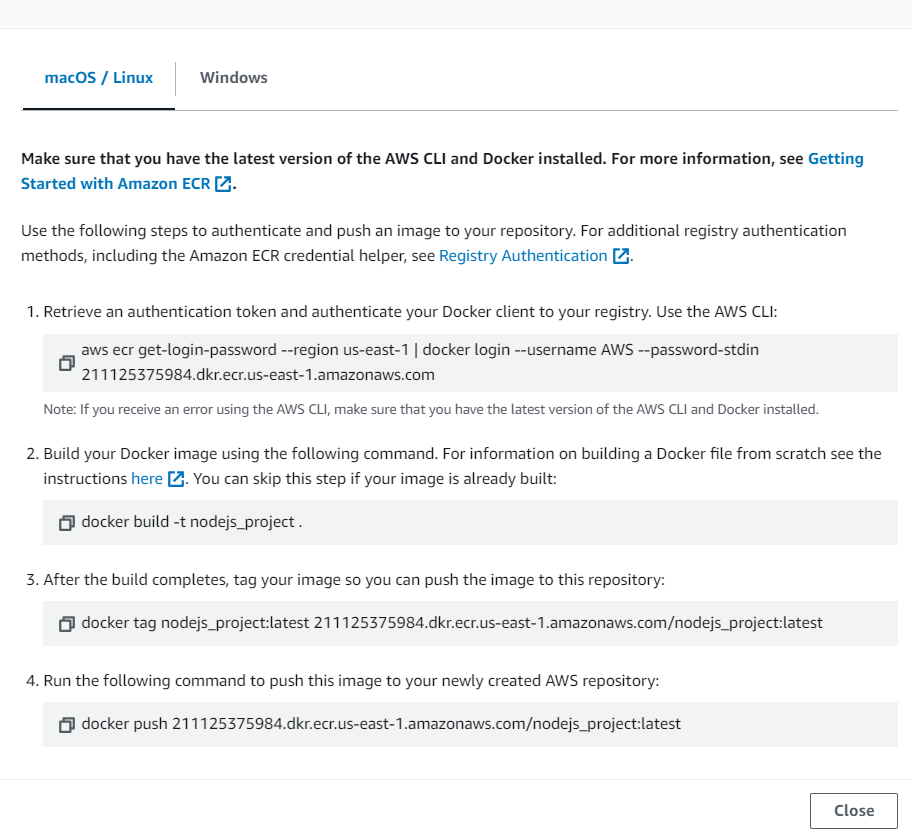
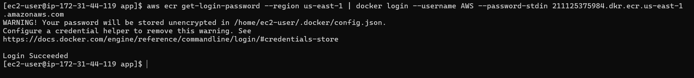
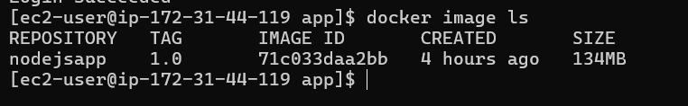
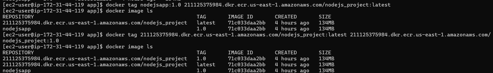
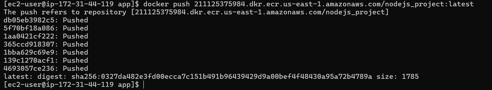
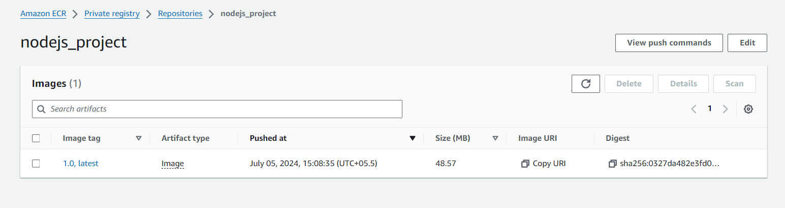

# Pushing docker image to ECR
## Prerequisites:
**AWS CLI Installed and Configured:** Make sure you have the AWS CLI installed.
**Docker Installed:** Ensure Docker is installed on your local machine.
**ECR Repository Created:** Create an ECR repository to push your Docker image to.
**EC2 Instance with IAM Role:** Ensure your EC2 instance has an IAM role attached with the necessary permissions.

### Step-1: Create an IAM Role with ECR Permissions
* Go to the IAM console in the AWS Management Console.
* Create a new role, and choose the service that will use this role (e.g., EC2).
* Attach the **_AmazonEC2ContainerRegistryFullAccess_** policy to the role. You can also create a custom policy with more restrictive permissions if needed.
  
  

### Step-2: Attach the IAM Role to Your EC2 Instance
* Go to the EC2 console.
* Select your instance, and choose `Actions > Instance Settings > Attach/Replace IAM Role`.
* Choose the IAM role you created and attach it to your instance.
  
  

### Step-3: Create an ECR Repository
* Go to ECR console.
* Click on "Repositories" in the left sidebar.
* Click Create repository
* Enter a unique name for your repository.
* Select public or private repository.
* Click "Create repository" to finish.
  
  

### Step-4: Authenticate Docker to Your ECR Registry
* If we click on view push commands we can see the commands to follow.
  
  

```bash
aws ecr get-login-password --region us-east-1 | docker login --username AWS --password-stdin 211125375984.dkr.ecr.us-east-1.amazonaws.com

```
  

### Step-5: Build Your Docker Image
* Created a docker image from this [Dockerfile](https://github.com/AWS-DevOps-BasicS/Docker?tab=readme-ov-file#dockerfile)
* Follow the steps and build an image.

  

### Step-6: Tag Your Docker Image
* Tag your Docker image with the ECR repository URI
```bash
docker tag nodejsapp:1.0 211125375984.dkr.ecr.us-east-1.amazonaws.com/nodejs_project:latest
```
  

### Step-7: Push Your Docker Image to ECR

* Push the tagged Docker image to your ECR repository
```bash
docker push 211125375984.dkr.ecr.us-east-1.amazonaws.com/nodejs_project:latest
```
  
  