# StopEC2WithNotification
### Step-1: Create an IAM Role for Lambda:
* Go to the AWS Management Console.
* Navigate to the IAM service.
* Create a new role with the following permissions:
    1. AmazonEC2FullAccess
    2. AmazonSNSFullAccess
    3. AWSLambdaBasicExecutionRole
* Attach this role to your Lambda function later.
  
  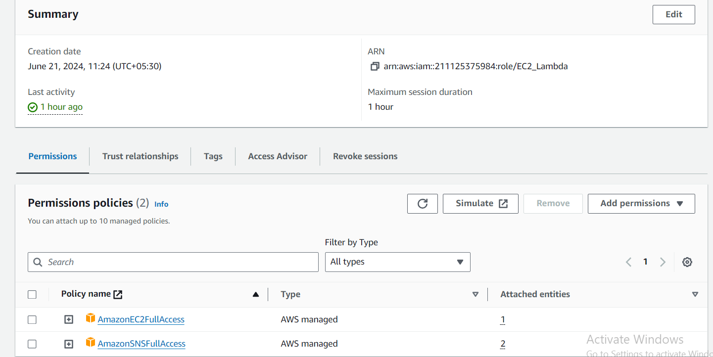

### Step-2: Create an SNS Topic and Subscription:

1. **Create a Topic:**

* In the left navigation pane, choose "Topics".
* Click on "Create topic".
* Choose "Standard" for the topic type.
* Enter a name for the topic (e.g., EC2ShutdownNotifications).
Optionally, configure other settings like access policies.
*Click "Create topic".
  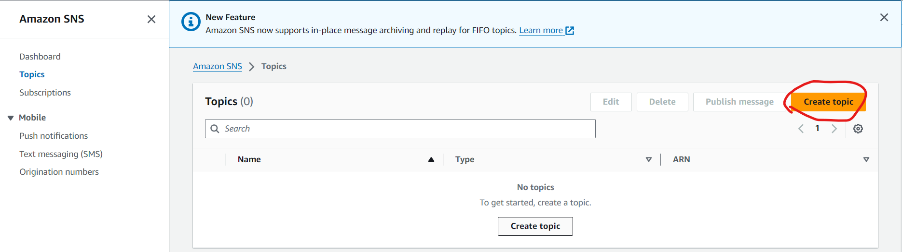
  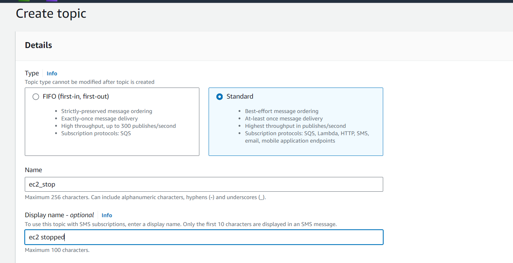

2. **Create an SNS Subscription:**
* Navigate to Your SNS Topic
* Go to the created topic by selecting it from the list in the SNS console.
* Click on "Create subscription".
* Choose the protocol (e.g., Email, Lambda).
* Enter the endpoint (e.g., email address, Lambda ARN).
* Click "Create subscription".
* Confirm the Subscription (if using Email):
* If you chose email as the protocol, check your email and click on the confirmation link to activate the subscription.
  
  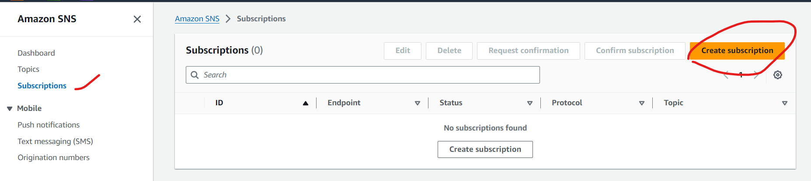
  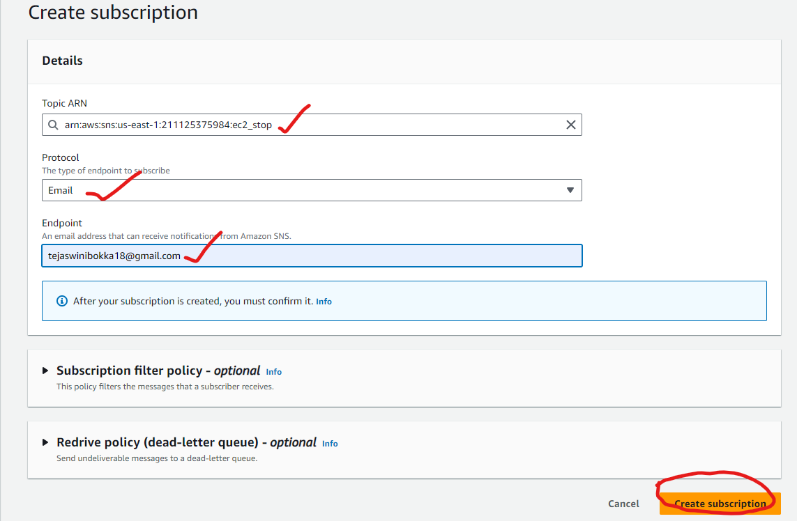
  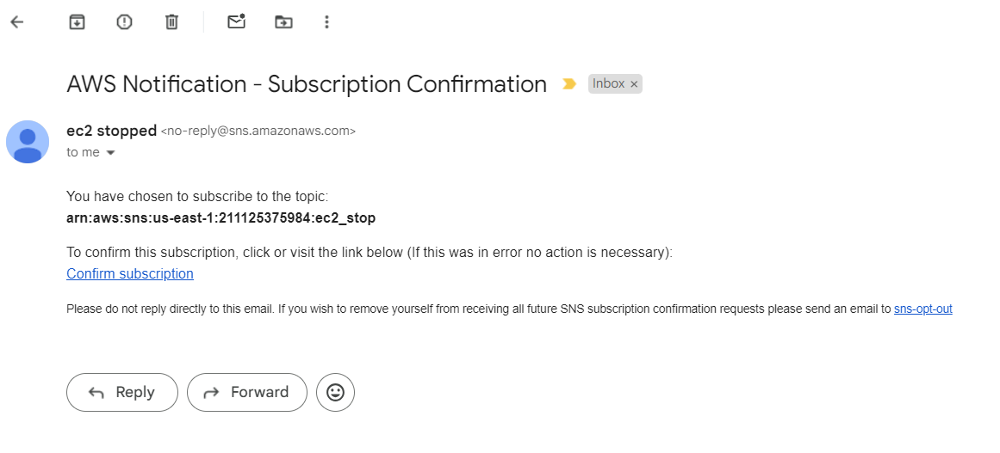
  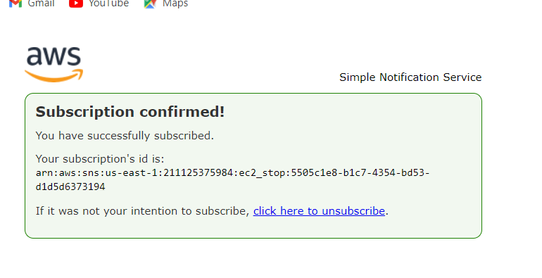

### Step-3: Create a Lambda Function:

* Click on "Create function".
* Choose "Author from scratch".
* Enter a name for your function (e.g., StopEC2Instances).
* Choose "Python 3.x" as the runtime.
* Choose or create an execution role with the necessary permissions (described below).
* Click "Create function".
  
  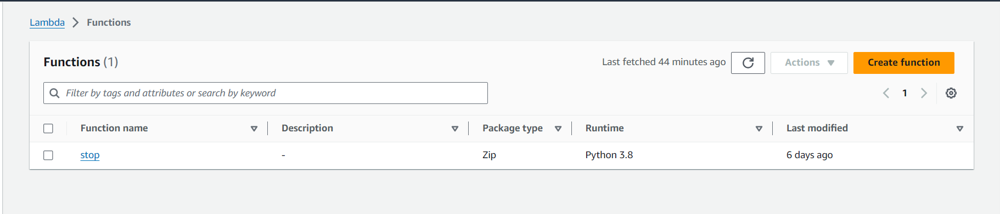

### Step-4: Deploy the Code:
* In the Lambda console, paste your code into the Lambda function code editor.
* Ensure the function is saved and deployed.
```python
import boto3
import os

# Get the environment variables
region = os.environ['REGION']
instance_ids = os.environ['INSTANCE_IDS'].split(',')  # Split if multiple instance IDs are comma-separated
sns_topic_arn = os.environ['SNS_TOPIC_ARN']  # Get the SNS Topic ARN

# Create EC2 and SNS clients
ec2 = boto3.client('ec2', region_name=region)
sns = boto3.client('sns', region_name=region)

def lambda_handler(event, context):
    try:
        # Stop instances
        ec2.stop_instances(InstanceIds=instance_ids)
        message = f'Successfully stopped your instances: {instance_ids}'
        print(message)
        
        # Publish success notification to SNS
        sns.publish(
            TopicArn=sns_topic_arn,
            Subject='Lambda Function Success',
            Message=message
        )
    except Exception as e:
        message = f'Failed to stop instances: {str(e)}'
        print(message)
        
        # Publish failure notification to SNS
        sns.publish(
            TopicArn=sns_topic_arn,
            Subject='Lambda Function Failure',
            Message=message
        )
        raise e

```
### Step-5: Prepare Environment Variables:
* In the AWS Management Console, navigate to the Lambda service.
* Create a new Lambda function or use an existing one.
* Under the "Configuration" tab, add the following environment variables:
    1. **REGION:** Your AWS region (e.g., us-east-1).
    2. **INSTANCE_IDS:** Comma-separated list of EC2 instance IDs you want to stop (e.g., i-1234567890abcdef0,i-0abcdef1234567890).
    3. **SNS_TOPIC_ARN:** The ARN of the SNS topic created in the previous step.
   
   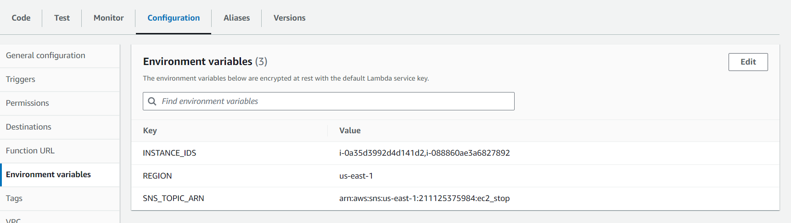

### Step-6: Integrate with EventBridge:
* Click on add trigger in lambda function.
* Select aws eventbridge.
  
  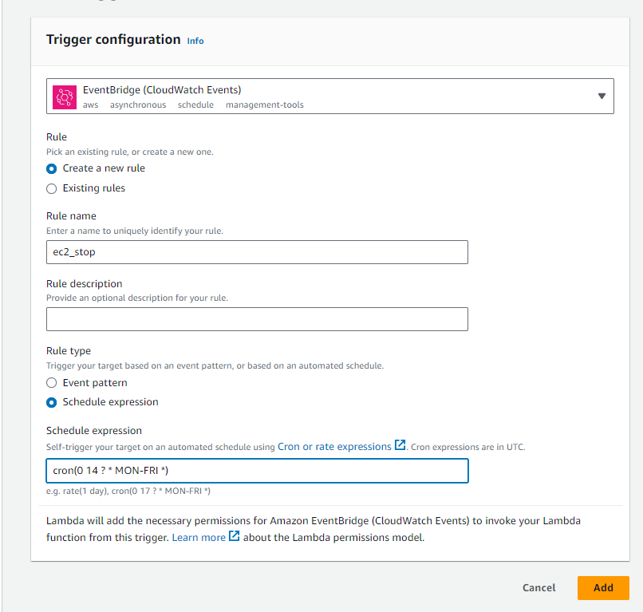
  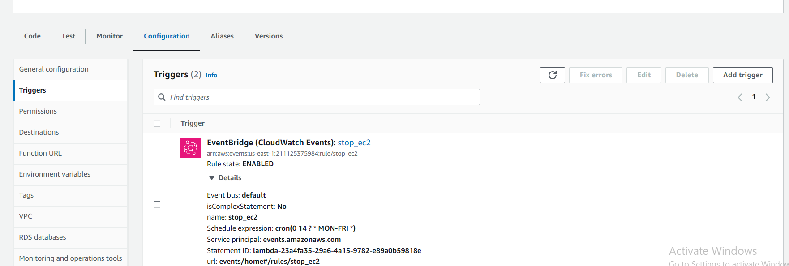
* Here I given crontab to stop instances at 07:30 P.M IST.

### Step-7: Checking
* Check instances are stopping at 07:30 P.M IST
  
  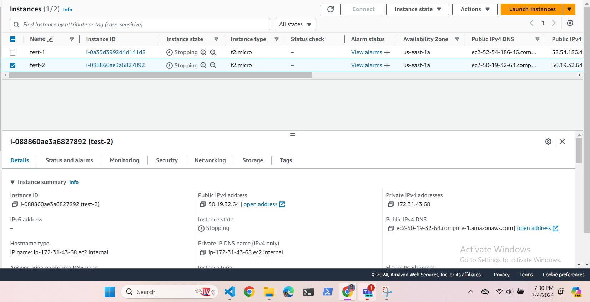

* Check mail for notification
  
  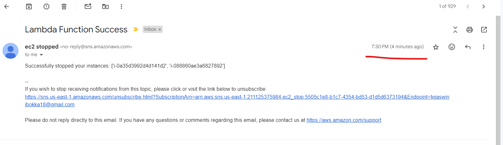

* Check cloudwatch logs
  
  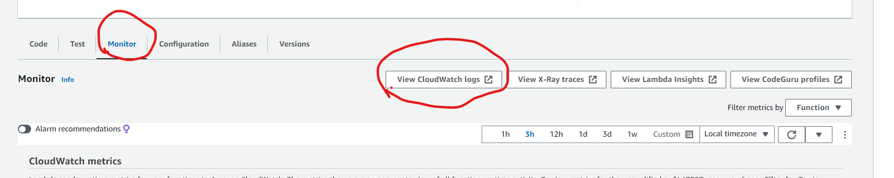
  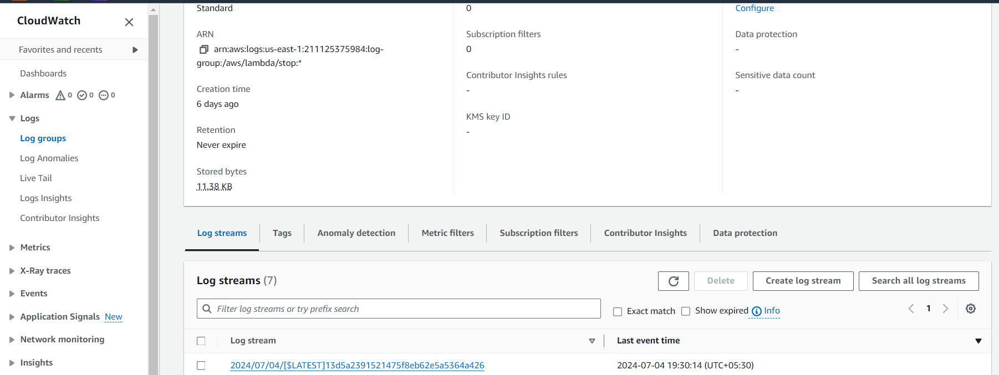

