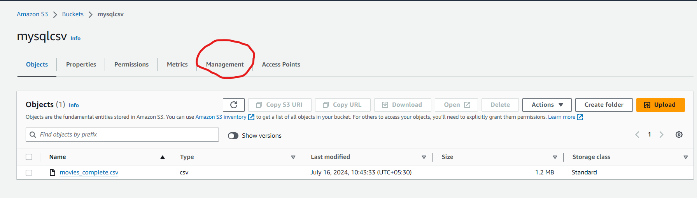

# S3 Glacier Archive and Cleanup
## Step-by-Step Guide to Create an S3 Bucket and Apply the Lifecycle Policy:
### Step-1: Create an S3 Bucket
**1. Log in to AWS Management Console**

* Open your web browser and navigate to the AWS Management Console.
* Enter your credentials to log in.
**2. Navigate to S3 Service:**

* In the AWS Management Console, search for "S3" in the top search bar.
* Click on "S3" to go to the S3 Dashboard.
**3. Create a New Bucket:**

* In the S3 Dashboard, click on the "Create bucket" button.
  
  

* Bucket Name: Enter a unique name for your bucket. The bucket name must be globally unique across all existing bucket names in Amazon S3.

  

**4. Configure Bucket Options:**

* Block Public Access Settings for This Bucket: By default, all public access is blocked. You can change these settings based on your use case.
* Bucket Versioning: You can enable versioning to keep multiple versions of an object in one bucket. For this example, you can leave it disabled.
* Default Encryption: You can enable default encryption if you want Amazon S3 to automatically encrypt all objects when they are stored in the bucket.
* Advanced Settings: Configure other settings like logging, tags, object lock, etc., as per your requirements.
* Review all the settings you have configured.
* Click on the "Create bucket" button to create your new S3 bucket.
  
  
  
  
  

### Step-2: Apply the Lifecycle Policy
**1. Go to the "Management" Tab:**

* Once inside the newly created bucket, you will see several tabs like "Overview," "Properties," "Permissions," etc.
* Click on the "Management" tab.
  
  

**2. Create a Lifecycle Rule:**

* In the "Management" tab, look for the "Lifecycle rules" section.
* Click on "Create lifecycle rule."
  
**3. Configure the Lifecycle Rule:**

* Rule Name: Enter a name for your lifecycle rule, e.g., "GlacierTransitionAndDeletion."
* Rule Scope: Specify the scope of the rule.
* Apply to all objects in the bucket: Select this if you want the rule to apply to all objects in the bucket.
* Apply to specific prefix or tags: Select this if you want to apply the rule to objects with a specific prefix or tags. For this example, we'll apply to all objects, so leave it as is.
  
  
  
**4. Add Transition Action:**

* Add transition: Click on "Add transition."
* Storage class transition:
    * Select "Current version" if you want the rule to apply to the current version of the objects.
    * Select "Previous versions" if you want the rule to apply to previous versions of the objects.
* Days after object creation: Enter "30" in the field to specify that objects should be transitioned to Glacier 30 days after creation.
* Destination storage class: Select "Glacier" from the dropdown menu.
  
  
  

**5. Add Expiration Action:**

* Add expiration: Click on "Add expiration."
* Days after object creation: Enter "365" (I have taken 2 days to check wheather the lifecycle is working or not)in the field to specify that objects should be deleted 365 days after creation.
  
  
  
  
**6. Review and Create the Rule:**

* Review the settings you have configured to ensure they are correct.
* Click on "Create rule" to apply the lifecycle policy to your bucket.

  
  

**By following these steps, you can create an S3 bucket and apply a lifecycle policy to transition objects to the S3 Glacier storage class after 30 days and delete them after 365 days, effectively managing your data lifecycle and optimizing costs.**