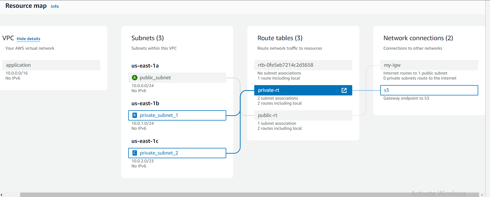
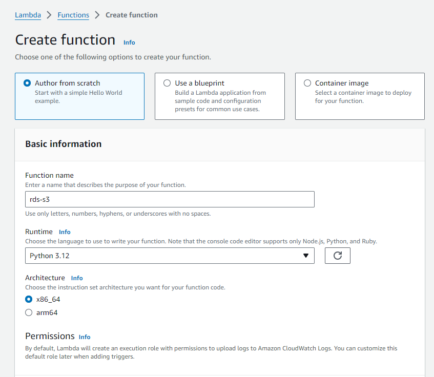

# S3 to Private Aurora MySQL RDS using lambda function
## Prerequisites
### 1. Private Network Configuration (VPC)

* **VPC:** Create a VPC with CIDR 10.0.0.0/16.
* **Subnets:** Create the following subnets:
    * **Public_Subnet** with CIDR 10.0.0.0/24
    * **Private_Subnet_1** with CIDR 10.0.1.0/24
    * **Private_Subnet_2** with CIDR 10.0.2.0/23
* Internet Gateway: Create an Internet Gateway and attach it to the VPC.
* Route Tables:
    * Public Route Table: Attach the Internet Gateway and the Public_Subnet to this route table.
    * Private Route Table: Attach Private_Subnet_1 and Private_Subnet_2 to this route table.
* Security Group: Create a Security Group with the following rules:
    * Allow SSH (port 22) from anywhere.
    * Allow MySQL (port 3306) within the VPC (10.0.0.0/16).
### 2. S3 Bucket

* Create an S3 bucket and upload your CSV files to this bucket.
### 3.SQS Queue

* Create an SQS queue to handle messages.
### 4.SNS Topic and Subscriptions

* Create an SNS topic.
* Create subscriptions to this topic, including an email subscription and an SQS subscription.
### 5.Aurora MySQL RDS

* Create an Aurora MySQL RDS instance with version 8.32.
* Ensure it is configured for private access (do not select public access).
### 6.IAM Role for Lambda

* Create an IAM role with the following policies attached:
    * AmazonRDSFullAccess
    * AmazonS3FullAccess
    * AmazonSNSFullAccess
    * AmazonSQSFullAccess
    * AWSLambdaBasicExecutionRole
    * AWSLambdaVPCAccessExecutionRole
    * SecretsManagerReadWrite
### 7.Secrets Manager

* Store your RDS credentials in AWS Secrets Manager.
### 8.Lambda Function

* Create a Lambda function with the provided code.
* Set the following environment variables in the Lambda function configuration:
    * **SECRET_NAME:** The ARN of the secret stored in Secrets Manager.
    * **DB_NAME:** The name of your database.
    * **SNS_TOPIC_ARN:** The ARN of your SNS topic.
    * **SQS_QUEUE_URL:** The URL of your SQS queue.
    * **BUCKET_NAME:** The name of your S3 bucket.
* Configure the Lambda function to run within your VPC by specifying the private subnets and the security group created earlier.
### 9. VPC Endpoints

* Create VPC endpoints for the following services to enable private connectivity without the need for a NAT gateway:
    1. S3
    2. Secrets Manager
    3. SNS
    4. SQS
   
## Detailed Steps
### Step 1: Create the VPC and Subnets
1. Go to the VPC Dashboard in AWS Management Console.
2. Create a new VPC:
    * Name: **`application`**
    * CIDR Block: **`10.0.0.0/16`**
3. Create the subnets:
    * Public_Subnet: **`10.0.0.0/24`**
    * Private_Subnet_1: **`10.0.1.0/24`**
    * Private_Subnet_2: **`10.0.2.0/23`**
4. Create and attach an Internet Gateway to application.
5. Create a Public Route Table:
    * Attach the Internet Gateway.
    * Associate it with `Public_Subnet`.
6. Create a Private Route Table:
    * Associate it with Private_Subnet_1 and Private_Subnet_2.
  
  

### Step 2: Create Security Group
1. Go to the EC2 Dashboard and select Security Groups.
2. Create a new Security Group:
    * Name: rds
    * VPC: application
3. Add Inbound Rules:
    * SSH: TCP, Port 22, Source: Anywhere
    * MySQL/Aurora: TCP, Port 3306, Source: 10.0.0.0/16
  
  

### Step 3: Create S3 Bucket
1. Go to the S3 Dashboard.
2. Create a new bucket:
    * Name: sns-sqs-rds
    * Upload your CSV files to this bucket.
  
  

### Step 4: Create SQS Queue
1. Go to the SQS Dashboard.
2. Create a new Standard Queue:
    * Name: s3-rds
  

### Step 5: Create SNS Topic and Subscriptions
1. Go to the SNS Dashboard.
2. Create a new topic:
    Name: RDS_S3_lambda
3. Create Subscriptions:
    * Email Subscription: Enter your email address.
    * SQS Subscription: Enter the ARN of your SQS queue.
  
  

### Step 6: Create Aurora MySQL RDS
1. Go to the RDS Dashboard.
2. Create a new Aurora MySQL database cluster:
    * Version: 8.32
    * DB instance class: Choose an appropriate instance class.
    * Do not enable public access.
    * Select Private_Subnet_1 and Private_Subnet_2 for subnet group.
    * Attach the security group rds.
  
  
  
  
  
  
  

### Step 7: Store RDS Credentials in Secrets Manager
1. Go to the Secrets Manager Dashboard.
2. Store a new secret:
3. Select "RDS Credentials".
4. Enter your RDS username and password.
    * Secret Name: rds/s3
  
  
  
  

* Configure rotation if needed and review then click on store.
  
  
  

### Step 8: Create IAM Role for Lambda
1. Go to the IAM Dashboard.
2. Create a new role:
3. Select Lambda as the trusted entity.
4. Attach the following policies:
    * AmazonRDSFullAccess
    * AmazonS3FullAccess
    * AmazonSNSFullAccess
    * AmazonSQSFullAccess
    * AWSLambdaBasicExecutionRole
    * AWSLambdaVPCAccessExecutionRole
    * SecretsManagerReadWrite

  

### Step 9: Create Lambda Function
1. Go to the Lambda Dashboard.
2. Create a new Lambda function:
    * Runtime: Python 3.x
    * Role: Select the IAM role created earlier.
3. Set environment variables:
    * **SECRET_NAME:** ARN of secret name
    * **DB_NAME:** Your database name.
    * **SNS_TOPIC_ARN:** The ARN of your SNS topic.
    * **SQS_QUEUE_URL:** The URL of your SQS queue.
    * **BUCKET_NAME:** sns-sqs-rds
  
  

4. Configure the Lambda function to run within your VPC:
    * Select Private_Subnet_1 and Private_Subnet_2.
    * Select rds.
  
  
  
  
   
   * Create the function. 
5. Add S3 bucket tigger and also add the layer for dependency.

    

6. Deploy the provided Lambda function code.
```python
import os
import logging
import boto3
import pymysql
from botocore.exceptions import ClientError
import json  # Ensure json module is imported

# Initialize clients
s3_client = boto3.client('s3')
sns_client = boto3.client('sns')
sqs_client = boto3.client('sqs')
secrets_manager_client = boto3.client('secretsmanager')  # Corrected client initialization

# Configure logger
logger = logging.getLogger()
logger.setLevel(logging.INFO)

def get_secret(secret_name):
    try:
        response = secrets_manager_client.get_secret_value(SecretId=secret_name)
        secret = response['SecretString']
        return secret
    except ClientError as e:
        logger.error(f"Failed to retrieve secret {secret_name}: {e}")
        raise

def lambda_handler(event, context):
    # Retrieve RDS credentials from Secrets Manager
    try:
        secret_name = os.environ['SECRET_NAME']  # Environment variable for SecretId
        secret = get_secret(secret_name)
        secret_dict = json.loads(secret)  # Parse secret string into dictionary
        
        rds_host = secret_dict['host']
        db_user = secret_dict['username']
        db_password = secret_dict['password']
        db_name = os.environ['DB_NAME'].strip()  # Remove any leading/trailing spaces
        sns_topic_arn = os.environ['SNS_TOPIC_ARN']
        sqs_queue_url = os.environ['SQS_QUEUE_URL']
        bucket_name = os.environ['BUCKET_NAME']
        
        connection = None
        cursor = None
        
        try:
            # Connect to the RDS instance
            connection = pymysql.connect(
                host=rds_host,
                user=db_user,
                password=db_password,
                connect_timeout=5
            )
            cursor = connection.cursor()
            
            # Ensure the database exists
            cursor.execute(f"CREATE DATABASE IF NOT EXISTS {db_name}")
            cursor.execute(f"USE {db_name}")
            
            # Ensure the table exists
            cursor.execute("""
                CREATE TABLE IF NOT EXISTS movies (
                    id INT,
                    title VARCHAR(100),
                    runtime INT
                )
            """)
            
            # Truncate the table (only if it exists)
            cursor.execute("TRUNCATE TABLE movies")
            
            # Process each S3 record
            for record in event['Records']:
                s3_object_key = record['s3']['object']['key']
                logger.info(f"Processing file: {s3_object_key}")
                
                # Download the file from S3
                download_path = f'/tmp/{s3_object_key}'
                s3_client.download_file(bucket_name, s3_object_key, download_path)
                logger.info(f"Downloaded file to {download_path}")
                
                # Load the data into Aurora MySQL
                with open(download_path, 'r') as file:
                    csv_data = file.readlines()
                    for row in csv_data:
                        row_data = row.strip().split(',')
                        cursor.execute(
                            "INSERT INTO movies (id, title, runtime) VALUES (%s, %s, %s)",
                            (row_data[0], row_data[1], row_data[2])
                        )
                
                # Commit changes to the database
                connection.commit()
                logger.info(f"Data from {s3_object_key} has been inserted into RDS.")
                
                # Send notification to SNS
                sns_client.publish(
                    TopicArn=sns_topic_arn,
                    Message=f"File {s3_object_key} has been processed and loaded into RDS."
                )
                
                # Send message to SQS
                sqs_client.send_message(
                    QueueUrl=sqs_queue_url,
                    MessageBody=f"File {s3_object_key} processed."
                )
        
        except pymysql.MySQLError as e:
            logger.error(f"MySQL error: {e}")
            raise
        
        finally:
            # Clean up resources
            if cursor:
                cursor.close()
            if connection:
                connection.close()
    
    except KeyError as e:
        logger.error(f"Missing environment variable: {e}")
        raise
    
    except Exception as e:
        logger.error(f"Unhandled exception: {e}")
        raise
    
    return {
        'statusCode': 200,
        'body': 'File processed and loaded into RDS successfully'
    }

```
* Test case:

```json
{
  "Records": [
    {
      "eventSource": "aws:s3",
      "eventName": "ObjectCreated:Put",
      "s3": {
        "object": {
          "key": "movies_complete.csv"
        }
      }
    }
  ]
}
```
### Step 10: Create VPC Endpoints
1. Go to the VPC Dashboard.
2. Create endpoints for the following services:
    * S3
    * Secrets Manager
    * SNS
    * SQS
  
  

### Step 11: Connect our Private RDS with workbench
1. We have create a bastion host(EC2 instance) in public subnet.
    
   

2. Now open mysql workbench --> New connection
   
   

   * **SSH Hostname:** This is the public DNS or IP address of your EC2 instance.
   * **SSH Username:** The default username of bastion host ec2 instance for Amazon Linux is typically ec2-user.
   * **SSH Key File:** The path to your private key file (.pem) which is used for connecting to the EC2 instance.
   * **MySQL Hostname:** The endpoint of your RDS instance.
   * **MySQL Server Port:** The port used by MySQL, which is typically 3306.
   * **Username:** The username for the MySQL RDS instance.
   * **Password:** The password for the MySQL RDS instance. This is stored securely.
3. Click on test connection --> ok 

   

4. Data before trigger.
   
   

### Step 12: Checking the lambda function is triggered or not

1. Upload the file in S3 bucket.
   
   
   

2. Now check the workbench.
   
   

3. Check cloudwatch logs
   
   

4. Check the mail.
   
   
  
**S3 but successfully triggered lambda function to send data from S3 to Private RDS**
