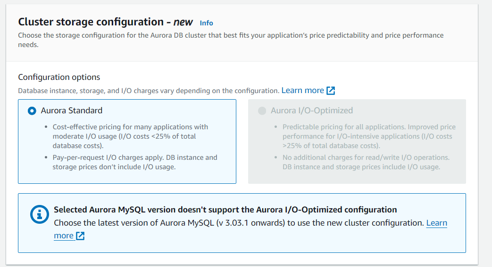
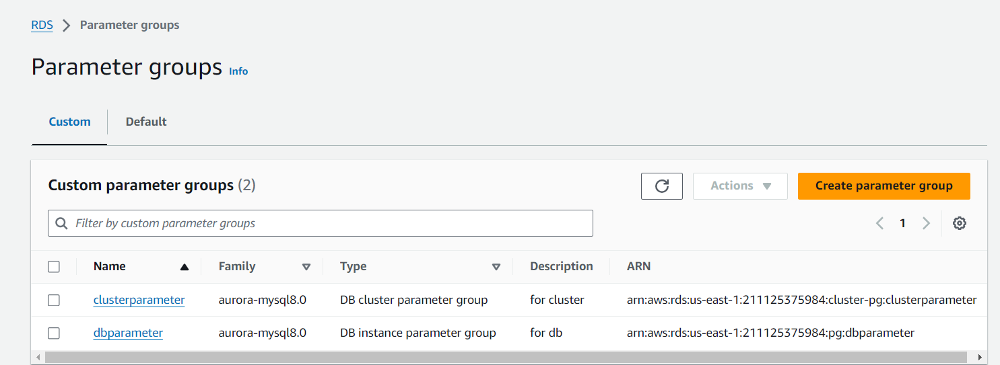
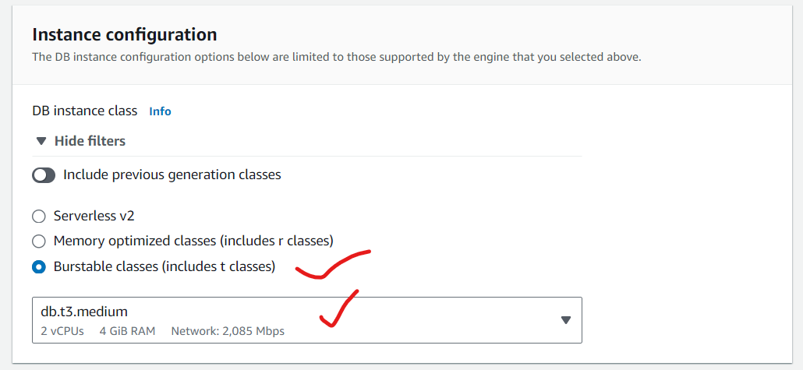

# Upgrade AWS Aurora MySql from 5.7 to 8.0.32 (5.7 will be deprecate very soon)
### Step-1: Create a RDS 
1. **Sign in to AWS Management Console:**

* Go to the AWS Management Console.
2. **Open the Amazon RDS Console:**

* In the console, type "RDS" in the search bar and select RDS from the dropdown.
3. **Create Database:**

* In the RDS Dashboard, click on Create database.
4. **Choose a Database Creation Method:**

* Select Standard create to customize your database configuration.
  
  

5. **Select Engine Options:**

* In the Engine options section, choose Amazon Aurora.
* Select Aurora MySQL-Compatible Edition.
* In the Edition dropdown, choose Amazon Aurora MySQL 5.7.
 
 
 

6. **Specify DB Cluster Identifier:**

* Enter a DB cluster identifier that is unique for your Aurora cluster. This is a name for your cluster.
 
 

7. **Master Username and Password:**

* Enter the Master username and Master password for the DB cluster. This will be the admin account for your database.
  
 

8. **DB Instance Class:**

* Choose the instance class that meets your needs (e.g., db.r5.large).
  
  

9. **Configure Storage:**

* Aurora uses a shared storage architecture, so you don’t need to specify storage size. However, you can configure other storage options if necessary.
  
  

10. **Configure Availability & Durability:**

* Choose whether to enable Multi-AZ deployment for high availability.
* Configure Aurora Replica settings if needed.
  
  

11.  **Connectivity:**

* Configure additional settings such as VPC, Subnets, Security groups, Parameter groups, and Option groups.
  
  
  
  
12.   **Database Authentication:**

* Configure database authentication (password or IAM database authentication).
  
  

13.  **Monitoring:**

* Enable Enhanced Monitoring and other monitoring features if required.
  
  

14. **Create Database:**

* After configuring all settings, click Create database.
  
  

### Step-2: Connect the created RDS with MySql Workbench
1. **Retrieve RDS Endpoint and Credentials:**

* Select your RDS instance.
* Under the "Connectivity & security" tab, find the endpoint and port (default is 3306).
* Ensure you have the master username and password for the RDS instance.
  
  

2. **Configure Security Group:**

* In the RDS dashboard, under "Connectivity & security", locate the VPC security groups.
* Click on the security group link to open the Amazon EC2 console.
* Ensure the security group allows inbound traffic from your IP address on the MySQL port (3306).
* Add a new rule if necessary: Type: "MySQL/Aurora", Protocol: "TCP", Port Range: "3306", Source: "Your IP address".
  
  

3. **Open MySQL Workbench:**

* Open MySQL Workbench on your local machine.
* Click on the "Database" menu and select "Manage Connections".
* Click on "New Connection".
  
  

4. **Create a New Connection:**

* In the "Connection Name" field, enter a name for your connection.
* In the "Hostname" field, enter the RDS endpoint from step 1.
* In the "Port" field, enter the port (default is 3306).
* In the "Username" field, enter the master username.
* Click on "Store in Vault" to save your password securely, then enter the master password.
  
  

5. **Test and Save the Connection:**

* Click on the "Test Connection" button to verify the connection settings.
* If the connection is successful, click "OK" to save the connection.
  
  

6. **Connect to the RDS Instance:**

* In MySQL Workbench, go to the "Home" tab.
* Under "MySQL Connections", click on the connection you just created.
* You should now be connected to your RDS instance and can start managing your databases.
  
  
  

### Step-3: Apply any dummy data on mysql 5.7
1. **Create the Database:**

* Open MySQL Workbench and connect to your MySQL instance.
* Open a new SQL tab by clicking the "+" button.
* Copy and paste the SQL commands to create the database and table, and execute them.
```sql
CREATE DATABASE dummy_db;
USE dummy_db;
CREATE TABLE employees (
    id INT AUTO_INCREMENT PRIMARY KEY,
    first_name VARCHAR(50) NOT NULL,
    last_name VARCHAR(50) NOT NULL,
    email VARCHAR(100) NOT NULL,
    hire_date DATE NOT NULL
);
```
2. **Insert Dummy Data:**

* Copy and paste the SQL commands to insert the dummy data, and execute them.
```sql
INSERT INTO employees (first_name, last_name, email, hire_date) VALUES
('John', 'Doe', 'john.doe@example.com', '2020-01-15'),
('Jane', 'Smith', 'jane.smith@example.com', '2019-03-22'),
('Mike', 'Johnson', 'mike.johnson@example.com', '2018-07-30'),
('Emily', 'Davis', 'emily.davis@example.com', '2021-11-01'),
('Chris', 'Brown', 'chris.brown@example.com', '2017-05-18');
```
3. **Verify the Data:**

* Run the SELECT statement to verify the inserted data.
```sql
SELECT * FROM employees;
```


### Step-4: Try to modify the Aurora MySQL from 5.7 to 8.0.32
1. Go to the RDS console
2. Select the RDS.
3. Click on modify

  

4. Select the required mysql version.

  

5. Give the password.

  

6. Click on modify changes. Its showing that we can't do the changes for the parameters.
   
   

### Step-5: Take a Snapshot of the MySQL 5.7 Database
1. **Take a Manual Snapshot:**
* Go to the RDS dashboard in the AWS Management Console.
* Click on "Snapshot " and then "Take snapshot".
* Select the snapshot type as "DB Cluster".
* Give a name to the snapshot.
* Click on "take snapshot".
  
  
  

### Step-6: Create Cluster Parameter Group and DB Parameter Group for Aurora MySQL 8.0
1. **Create a Cluster Parameter Group:**

* In the RDS dashboard, go to "Parameter groups".
* Click on "Create parameter group".
* Select "Parameter group family" as "aurora-mysql8.0".
* Enter a name and description for the cluster parameter group.
* Click "Create".
   
   
   

2. **Create a DB Parameter Group:**

* In the same "Parameter groups" section, click "Create parameter group" again.
* Select "Parameter group family" as "aurora-mysql8.0".
* Enter a name and description for the DB parameter group.
* Click "Create".
  
  
  

### Step-7: Restore the Database from the Snapshot
1. **Restore Snapshot to Aurora MySQL 8.0:**
* Go to the RDS dashboard.
* Click on "Snapshots" and select the snapshot you created earlier.
* Click on "Actions" and then "Restore snapshot".
* Select "Amazon Aurora" as the DB engine.
* Choose "Aurora MySQL" as the edition and "8.0.mysql_aurora.8.0" as the version.
* Configure the DB cluster identifier, instance class, and other settings as needed.
* Under "Additional configuration", select the cluster parameter group and the DB parameter group you created earlier.
* Click "Restore DB cluster".
  
  
  
  
  
  
  
  

### Step-8: Verify the Upgrade and Check Status
1. **Check Cluster Status:**

* Go to the RDS dashboard.
* Navigate to "Databases" and find the newly restored Aurora cluster.
* Check the status of the instances in the cluster. They should be "available".
  
  

2. **Check Version:**

* Click on the cluster and check the "Configuration" tab to ensure it’s running Aurora MySQL 8.0.
  
  

### Step-9: Connect the restored RDS with MySQL Workbench and check the data is present or not

* Follow Step-2: Connect the created RDS with MySql Workbench
* After connection, see the db you created in other RDS is present and check the table
  
  